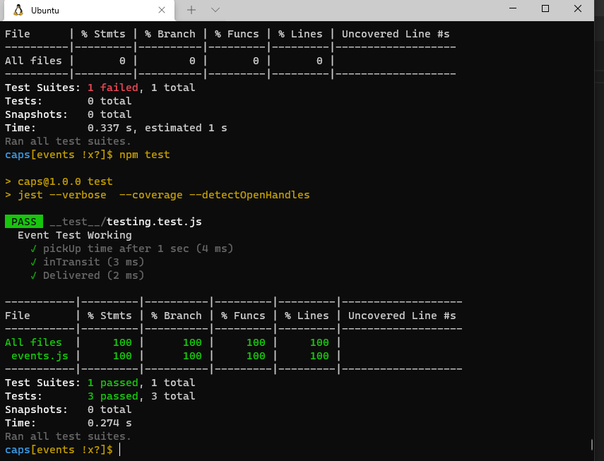

# Caps

# CAPS "The Code Academy Parcel Service"

CAPS Phase 1: Begin the build of an application for a company called CAPS - The Code Academy Parcel Service. In this sprint, we’ll build out a system that emulates a real world supply chain. CAPS will simulate a delivery service where vendors (such a flower shops) will ship products using our delivery service and when our drivers deliver them, be notified that their customers received what they purchased.

## User and Developer stories coverage

1. user stories:

- [] As a vendor, To alert the system when I have a package to be picked up
- [] As a driver, To be notified when there is a package to be delivered
- [] As a driver, To alert the system when I have picked up a package and it is in transit
- [] As a driver, To alert the system when a package has been delivered
- [] As a vendor, To be notified when my package has been delivered

2. Developer Stories:

- [] As a developer, To use industry standards for managing the state of each package
- [] As a developer, To create an event driven system so that I can write code that happens in response to events, in real time
 

## Testing 

## [Pulls](https://github.com/En-ZUH/caps/pulls)

## UML Diagram
 
